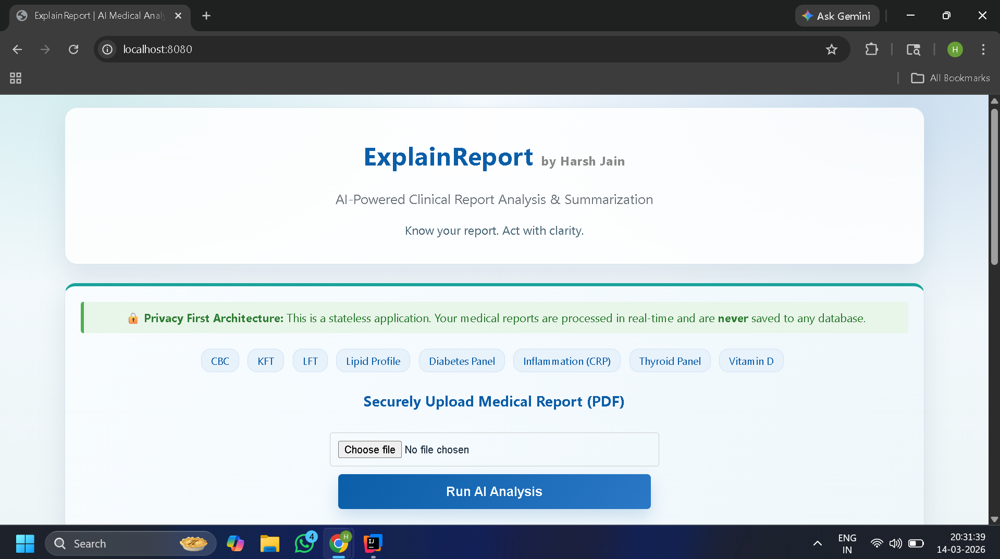
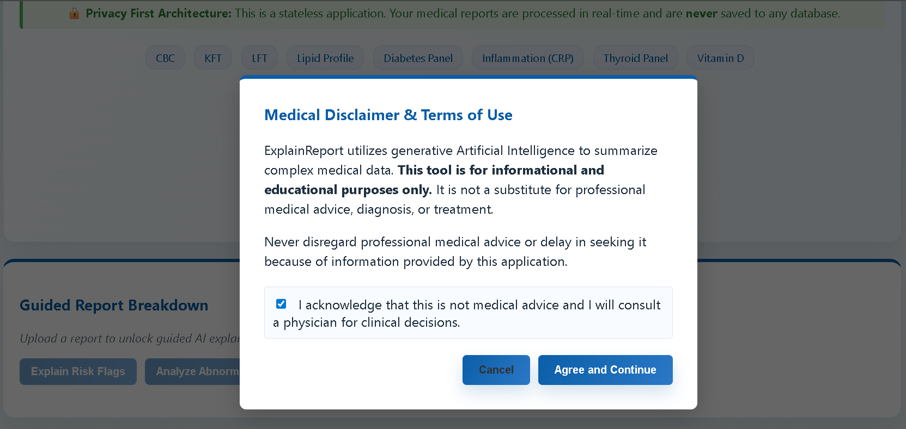
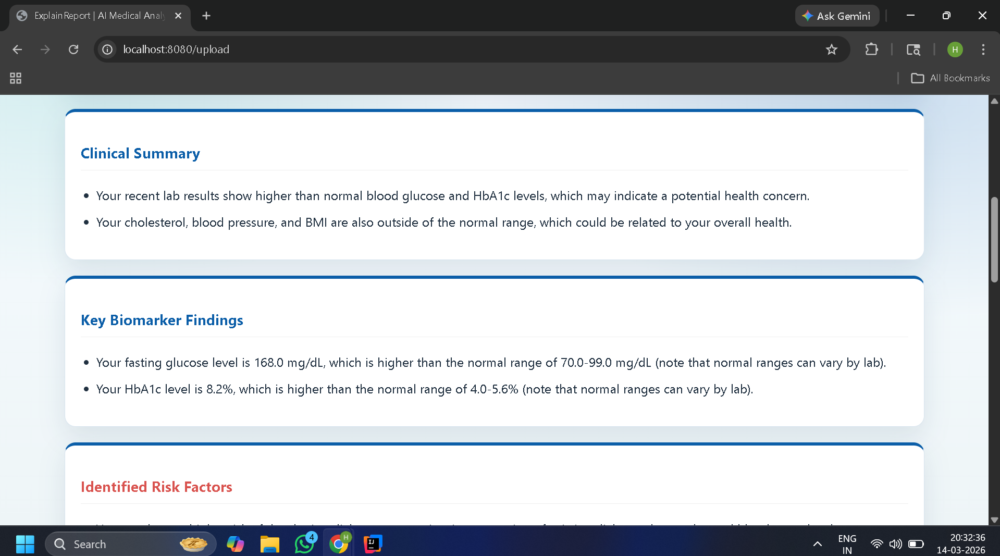
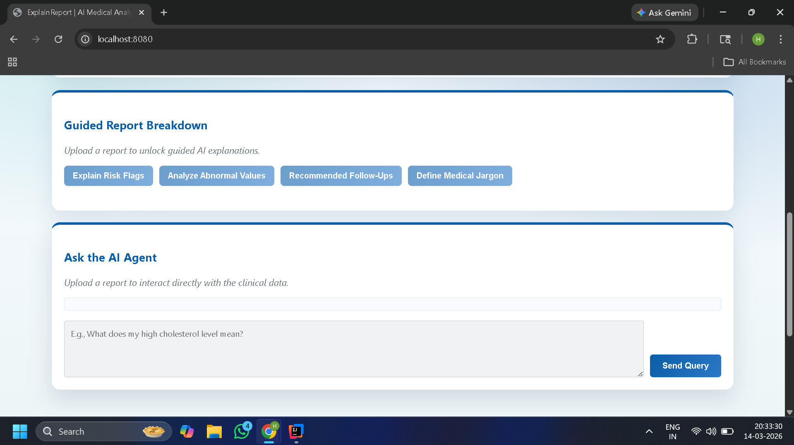

# ExplainReport – AI Medical Report Analyzer

ExplainReport is a web application that helps users understand medical lab reports easily.
Users can upload a **PDF medical report**, and the system extracts values, checks normal ranges, detects risks, and generates a simple explanation using AI.

The goal is to convert complex medical data into **clear insights for patients**.

---

# Features

* Upload medical report in **PDF format**
* Automatic **parameter extraction** (Hemoglobin, WBC, Glucose, etc.)
* **Normal range comparison**
* Detect **abnormal values**
* AI generated **summary of the report**
* **Risk flag detection**
* Suggested **questions for doctor**
* **Next step recommendations**
* Interactive **AI chat** to ask questions about the report
* **Guided insights** explaining medical terms
* Export analysis as **PDF or TXT**
* **Privacy-first design** (no report stored)

---

## Home Page


## Upload Medical Report


## AI Analysis Results


## AI Chat Assistant


---

# How It Works
1. User uploads a **PDF medical report**
2. System extracts text using **PDFBox**
3. Parameters like **Hemoglobin, WBC, etc.** are detected
4. Values are compared with **normal medical ranges**
5. System identifies:

   * Normal values
   * Low values
   * High values
6. AI generates:

   * Summary
   * Key findings
   * Risk flags
   * Doctor questions
   * Next steps
7. User can ask questions using **AI chat**

---

# Installation Guide

## Step 1 — Clone the Repository

```bash
git clone https://github.com/yourusername/explainreport.git
```

## Step 2 — Navigate to the Project

```bash
cd explainreport
```

## Step 3 — Configure Groq API Key

Open:

```
src/main/resources/application.properties
```

Add your Groq API credentials:

```
groq.api.key=YOUR_API_KEY
groq.api.url=https://api.groq.com/openai/v1/chat/completions
```

## Step 4 — Run the Application

Using Maven:

```bash
mvn spring-boot:run
```

or

```bash
./mvnw spring-boot:run
```

## Step 5 — Open the Application

Open in browser:

```
http://localhost:8080
```


